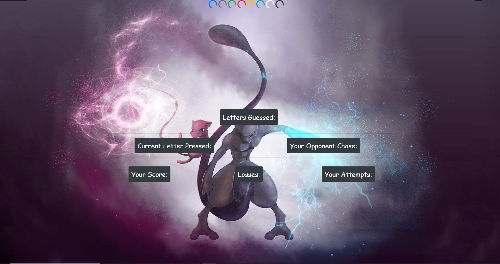

# Psychic-Game
### Links: 
https://bryanjacinto1994.github.io/Psychic-Game/
https://github.com/bryanjacinto1994/Psychic-Game

## Images




<hr>

## Tools Used:

* Visual Studio Code - Open source code editor for building and debugging web and cloud applications.
* JavaScript - A scripting language that uses curly-bracket syntax, first class functions and object-oriented.
* HTML - Used to create elements on the DOM.
* CSS - Styles the html elements on page. 
* Git - Version control system to track changes to source code.
* Github - Hosts respository that can be deployed to GitHub pages.


<hr>

## Summary

Using HTML, JavaScript, and CSS via Visual Studio Code, a guessing game called "Psychic-Game" is created by making functions from a javascript file. 

In the JavaScript file "game.js", a list of instructions was first made to determine which functions goes first. Having an outline made before inputing the codes will give the coder a better and clear understanding on which steps should that coder make next.

Upon making a list of instructions, a code function will be inputted according to that instruction. For example, in my file, I have made a list of instructions written down on a notebook and inputed them down onto the "game.js" file. Once the instructions are typed down, a code was inputted in each instruction. 

A variable of array was first made to determine all 26 letters of the alphabet. Then, list of variables to set up all the scores.
The most important part of this program is to set up a function called "document.onkeyup" which executes a letter on the HTML screen webpage once a key letter is pressed down. Then, a function for randomizing the letters for a computer to guess was also created by inputting "Math.Random" function. 

After all of those are planned and typed out, a statement was made to determine whether a user will win or lose if the user's key pressed matches the computer's randomized guess.


<hr>

## Code Snippet

Psychic.html :
```html
<!DOCTYPE html>
<html lang="en">

<head>
    <meta charset="utf-8">
    <meta name="viewport" content="width=device-width, initial-scale=1, shrink-to-fit=no">

    <title>Psychic-Game</title>
    <link rel="stylesheet" href="assets/css/style.css">
    <link rel="stylesheet" href="assets/css/reset.css">
    <link rel="stylesheet" href="https://stackpath.bootstrapcdn.com/bootstrap/4.3.1/css/bootstrap.min.css"
        integrity="sha384-ggOyR0iXCbMQv3Xipma34MD+dH/1fQ784/j6cY/iJTQUOhcWr7x9JvoRxT2MZw1T" crossorigin="anonymous">
</head>

<body>
    <script src="https://code.jquery.com/jquery-3.3.1.slim.min.js"
        integrity="sha384-q8i/X+965DzO0rT7abK41JStQIAqVgRVzpbzo5smXKp4YfRvH+8abtTE1Pi6jizo"
        crossorigin="anonymous"></script>
    <script src="https://cdnjs.cloudflare.com/ajax/libs/popper.js/1.14.7/umd/popper.min.js"
        integrity="sha384-UO2eT0CpHqdSJQ6hJty5KVphtPhzWj9WO1clHTMGa3JDZwrnQq4sF86dIHNDz0W1"
        crossorigin="anonymous"></script>
    <script src="https://stackpath.bootstrapcdn.com/bootstrap/4.3.1/js/bootstrap.min.js"
        integrity="sha384-JjSmVgyd0p3pXB1rRibZUAYoIIy6OrQ6VrjIEaFf/nJGzIxFDsf4x0xIM+B07jRM"
        crossorigin="anonymous"></script>

        <div id="spinner" class="spinner-border text-primary" role="status">
                <span class="sr-only">Loading...</span>
              </div>
              <div class="spinner-border text-secondary" role="status">
                <span class="sr-only">Loading...</span>
              </div>
              <div class="spinner-border text-success" role="status">
                <span class="sr-only">Loading...</span>
              </div>
              <div class="spinner-border text-danger" role="status">
                <span class="sr-only">Loading...</span>
              </div>
              <div class="spinner-border text-warning" role="status">
                <span class="sr-only">Loading...</span>
              </div>
              <div class="spinner-border text-info" role="status">
                <span class="sr-only">Loading...</span>
              </div>
              <div class="spinner-border text-light" role="status">
                <span class="sr-only">Loading...</span>
              </div>
              <div class="spinner-border text-dark" role="status">
                <span class="sr-only">Loading...</span>
              </div>


    <div class="container">
        <h1>
            <div class="row">
                <div class="col-md-12">
                    <button type="button" class="btn btn-dark" style="padding: 10px; font-size: 25px;">
                        <div id="letterGuess">Letters Guessed: </div>
                    </button>
                </div>
            </div>
<hr>
<hr>

            <div class="row">
                <div class="col-md-6">
                    <button type="button" class="btn btn-dark" style="padding: 10px; font-size: 25px;">
                        <div id="your-guesses">Current Letter Pressed:</div>
                    </button>
                </div>
                <div class="col-md-6">
                    <button type="button" class="btn btn-dark" style="padding: 10px; font-size: 25px;">
                        <div id="computer-pressed">Your Opponent Chose:</div>
                    </button>
                </div>
            </div>
<hr>
<hr>

            <div class="row">
                <div class="col-md-4">

                    <button type="button" class="btn btn-dark" style="padding: 10px; font-size: 25px;">
                        <div id="you-win">Your Score:</div>
                    </button>
                </div>
                <div class="col-md-4">
                    <button type="button" class="btn btn-dark" style="padding: 10px; font-size: 25px;">
                        <div id="you-lose">Losses:</div>
                    </button>
                </div>
                <div class="col-md-4">
                    <button type="button" class="btn btn-dark" style="padding: 10px; font-size: 25px;">
                        <div id="guesses-left">Your Attempts:</div>
                    </button>
                </div>
            </div>

        </h1>
    </div>
<script src="assets/javascript/game.js"></script>
</body>

</html>
 
```
JavaScript: 

``` javascript 
//Make a variable name of "computerChoices" and a value of arrays with all 26 letters in the alphabet.
var computerChoices = ["a", "b", "c", "d", "e", "f", "g", "h", "i", "j", "k", "l", "m", "n", "o", "p", "q", "r", "s", "t", "u", "v", "w", "x", "y", "z"];
//Make a variable for each score subjects.
var wins = 0;
var lose = 0;
var attempts = 9;
var guessMade = [];
var lettersPressed = lettersPressed;
//Make a function for when a user press a key, that specific key is pressed.
document.onkeyup = function (event) {
    //Make a variable computerGuess and a function that randomizes the alphabet letters.
    var computerGuess = computerChoices[Math.floor(Math.random() * computerChoices.length)];
    //Make a variable for the user when a key is pressed via document.onkeyup.
    var userGuess = event.key;
    //Make if statements for a user and computer that shows which key is pressed on either sides.
    if ((userGuess === computerChoices.length && computerGuess === computerChoices.length)) {
    }
    //Make if statements where a user's keys is equal to the computers keys.
    if ((userGuess === computerGuess && computerGuess === userGuess)) {
        wins++; //User wins and gets a point which will increment by 1. 
        attempts--; //attempts number will decrease whenever a key is guessed/pressed.
        guessMade = []; //letters guessed.
    }
    //Make an else if statement where if the user's keys is not equal to the computer's keys and also attempts count decrease.
    else if (userGuess !== computerGuess) {
        attempts--;
    }
    //Make a statement for when attempts reaches "0", user loses and score resets.
    
    if (attempts == 0) {
        attempts = 9; //This resets back to 9 when the attempt reaches 0.
        lose++; //User lose and the score of loss will increment by 1.
        guessMade = []; //Letters guessed.
    }
    //Also a statement for leters that are guessed to be shown and disappear when user=computer.
    if (guessMade.indexOf(userGuess) >= 0) {       
    }

    else { //This shows and pushes the letter keys pressed onto the screen which makes it visible to the user.
        guessMade.push(userGuess);
        document.getElementById("letterGuess").innerHTML = guessMade;
    }
    //Put all IDs and Text-Contents here
    var yourGuesses = document.getElementById("your-guesses");
    var computerPressed = document.getElementById("computer-pressed");
    var youWin = document.getElementById("you-win");
    var youLose = document.getElementById("you-lose");
    var guessesleft = document.getElementById("guesses-left");

    yourGuesses.textContent = "Current Letter Pressed: " + userGuess;
    computerPressed.textContent = "Current Letter Pressed: " + computerGuess;
    youWin.textContent = "Your Score: " + wins;
    youLose.textContent = "Losses: " + lose;
    guessesleft.textContent = "Your Attempts: " + attempts;
};
```

CSS:

``` css
body{
    background-image: url("http://getwallpapers.com/wallpaper/full/e/2/c/275390.jpg");
    
}

.container {
    text-align: center;
    margin-top: 20%; 
    font-family: 'Wallpoet', cursive;
    
}

#spinner {
    margin-left: 42%;
}
```


## Author Links
Linkedin: https://www.linkedin.com/in/bryan-jacinto-100438aa/

Github:
https://github.com/bryanjacinto1994


 
